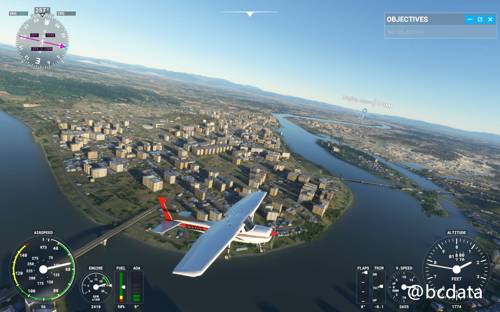
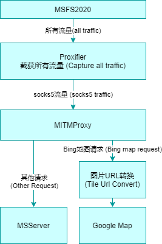
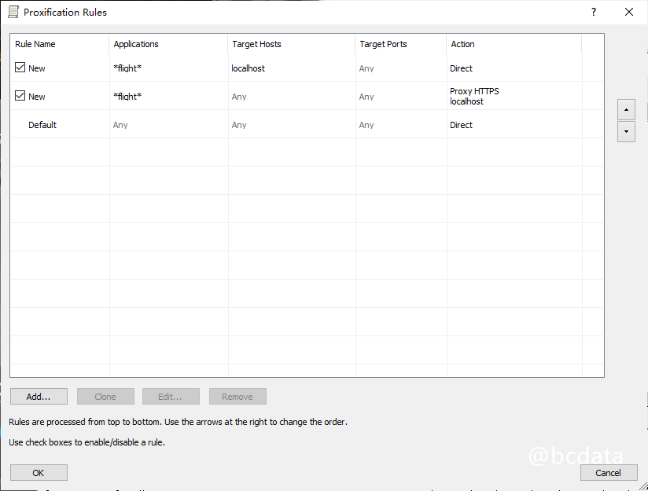
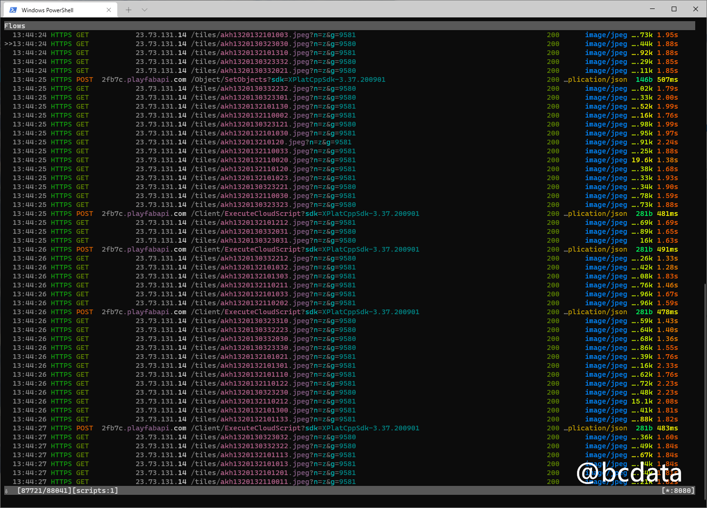
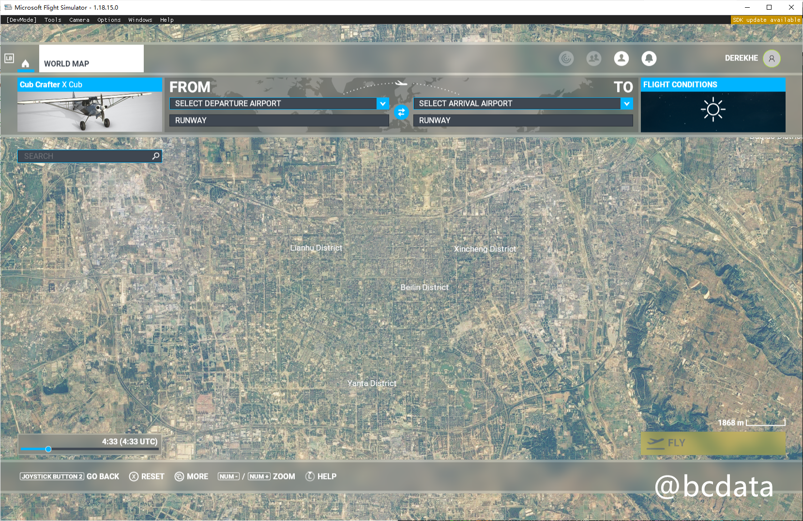

# 中文
## 免责声明

本教程提到的方法仅用于研究和学习用途。我不对使用、拓展该教程及方法所造成的任何法律责任和损失负责。

## 背景

微软模拟飞行2020的地景使用了Bing的卫星地图，然而卫星地图比较老旧，很多地区都是几年前的图设置直接是没有的。这种现象在全球不同地区都有。在大陆的图更是10年前的图，有大量地区的卫星图都是没有的，微软便使用程序生成的图代替，质量非常的差。替换过后画质和细节得以明显的提升，可以见下图

## 原始地图

## Google地图替换后可以得到高清最新的影像

### 一个小城镇

### 青海湖（这些卫星图在Bing中不存在）

### 成都

### 香港

## 历史及相关资料

我很早就在研究用谷歌地图替换的可能性，在网上也有油管大神提供了[一些思路](https://flightsim.to/file/4074/google-earth-decoder-optimisation-tools?__cf_chl_jschl_tk__=pmd_2902fb008a3441de2f812b093625596ad796f737-1628304162-0-gqNtZGzNAk2jcnBszQjO)，使用爬虫从谷歌爬下数据然后导入到MSFS2020中。但这种方式比较复杂，不能大规模的使用。

后来我研究了下网络请求，发现MSFS会从bing的服务器上下载图片，理论上讲将图片替换成另外的图片应该是可以的。而且恰好bing和google的卫星图片的切片方式是类似的可以进行无缝切换，甚至微软还提供了转换的[源代码]（https://docs.microsoft.com/en-us/bingmaps/articles/bing-maps-tile-system）（见QuadKeyToTileXY这个函数）

在不断的搜索过程中，发现了[和我思路类似的例子](
https://github.com/muumimorko/MSFS2020_CGLTools/issues/2#issuecomment-762232597)。但他的主要目的是将一些不要的东西去掉以改善地景质量。他还建立了一个另外的仓库用来演示一个[使用代理方式替换地景的方法]（https://github.com/muumimorko/MSFS2020_Proxy）。遗憾的是这个仓库缺少一些必要的东西，无法正常的运行。

## 原理

借鉴上面的思路，我整理出了以下的方法来实现流量截获和修改。

涉及到的工具，请自行安装
* [mitmproxy](https://mitmproxy.org/)
  * 安装最新版本
  * 保证mitmproxy的https证书正确安装并加入到系统的信任列表，否则无法劫持流量
  * 参考
    * https://docs.mitmproxy.org/stable/concepts-certificates/
    * https://docs.mitmproxy.org/stable/overview-getting-started/
* [proxifier](https://www.proxifier.com/)
  * 设置Windows全局代理并不能将地图相关的流量转到mitmproxy中。Proxifier能够将进程的流量转发到上层的proxy中，达到目的。或许还有其他的方案可行。
* [python3](https://www.python.org/downloads/)
  * 安装3.8版本的所有内容
* [python3的requests库](https://docs.python-requests.org/en/master/)
  * 使用`pip3 install requests`安装
* 一个可以访问Google的HTTP代理

实现步骤

* （国内用户）关闭任何加速器，要不然流量不会被劫持
* 安装Proxifier并设置代理配置（我的版本是4.0.3版本）。代理设置为mitmproxy的端口号（默认8080）
   
* **按顺序** 配置Proxifier的代理规则：
  * 将`*flight*`进程对应的localhost的流量发送到Direct（直连）
  * 将`*flight*`进程其他的流量发送到上面配置的代理中
  
* 修改mitm.py中的`proxy_url`到你能访问Google的代理
* 在当前目录下运行`run.bat`启动mitmproxy
  
* 启动模拟飞行
* 此时proxifier就会截获流量，同时mitmproxy也会有显示流量，这些jpeg的流量就是卫星图
  
  
* 尽情享用吧
  

# 赞助

如果你已经成功的实现了，请给个star，让更多人看到！
如果你愿意给与作者一些赞助，请扫描以下二维码支持一下作者。

